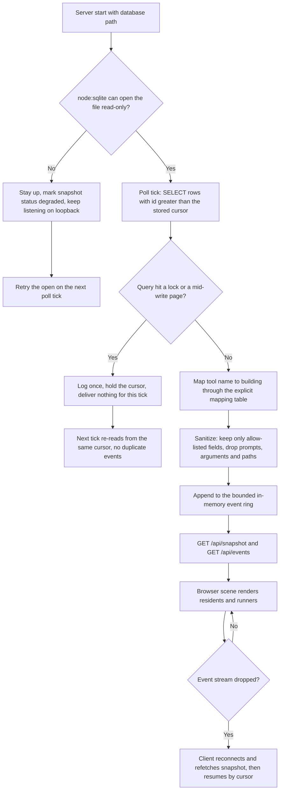

# OpenCrabs Reef Lite PRD

## 1. Overview

### Layer 1: Human PRD

| Field | Content |
|-------|---------|
| Problem | An OpenCrabs agent runs continuously on a small VPS, but its activity is only visible through text logs and the `/audit` command. To answer "how many sessions are live, what is each one touching right now, which runs failed" the operator has to open a terminal and read rows. There is no at-a-glance view, and nothing shareable with the community. |
| Outcome | One browser page showing a submerged pixel-art town. Each OpenCrabs execution context is one resident. Each tool call sends that resident to the building that owns the activity, so work is legible as motion rather than as log lines. The server behind it has to be light enough to run beside the existing production services on a 1 GB VPS, and the public version must not leak any real agent activity. |
| Users | Primary: Adi, the operator, viewing the live town on loopback over an SSH tunnel. Secondary: the community, viewing a public demo that runs on synthetic data only. Tertiary: downstream automation reading the same HTTP snapshot and event endpoints. |
| Scope and exclusions | In scope: a read-only visualisation of OpenCrabs sessions, tool calls, turn outcomes and cron runs, rendered as an underwater town, plus a static public demo. Out of scope: sending commands to the agent, any write to `opencrabs.db`, multi-user authentication, historical analytics dashboards, mobile layouts, and anything that makes the town a game. Upstream Hermes-specific surfaces (the plugin, the ingress token endpoint, the land theme) are out of scope for this fork. |
| Decisions and assumptions | Owner decisions: fork `sxuff/hermes-town` (MIT, verified this date); theme is an underwater or coastal town, not a city; publish the result as a public repository; weight is a first-class requirement because the target host is low-spec; build and test heavy jobs on the `tencent` VPS, never on `joyboy`. Proposed defaults accepted by the owner: repository name `opencrabs-reef`; event source is a read-only poller over `~/.opencrabs/opencrabs.db` rather than a plugin; live bridge binds to loopback only. Open question that is not blocking: whether the final art direction stays a recompressed upstream atlas or moves to a baked, re-authored reef atlas, resolved by AC-009 and AC-010 in milestone 2. |
| Research basis | Upstream repository facts verified on 2026-10-03 through the GitHub API and a real clone: MIT licence covering code and artwork, TypeScript plus Vite plus Phaser 3.90, one runtime dependency (`phaser`), a zero-dependency Node server, and 14.9 MB of repository content of which 4.6 MB is QA screenshots and 11 MB is the duplicated plugin runtime. OpenCrabs state verified on the same date against the live database schema: `sessions`, `tool_executions` with `tool_name`, `status` and `session_id`, `turn_outcomes`, `cron_job_runs`, `usage_ledger`. Built-in `node:sqlite` `DatabaseSync` verified working on the host. Asset recompression measured: 9.98 MB to 3.85 MB, visually compared against the originals. Still UNVERIFIED: the 2 MB asset ceiling in the Constraints table has not been met yet, and no Reef runtime exists, so every runtime measurement in this PRD is a budget to be proven, not an observation. |

### Layer 2: Machine Spec

| Field | Content |
|-------|---------|
| Tool Type | Local HTTP service plus browser-rendered visualisation, with a static demo build as a second deliverable. |
| Trigger | Manual start of the server process. After start, an interval poller (default 2000 ms, bounded by NFR-001) advances a cursor over `opencrabs.db` and pushes deltas to connected clients over server-sent events. |
| Inputs | `~/.opencrabs/opencrabs.db` opened read-only through `node:sqlite`. Read paths: `sessions` for residents, `tool_executions` for runners and activity, `turn_outcomes` for verified or failed states, `cron_job_runs` for scheduled activity. No other host state is read. |
| Outputs | Static single-page build; `GET /api/snapshot` returning the current town as JSON; `GET /api/events` as a server-sent event stream of sanitised town events; one line of startup JSON carrying the bound address and port. In demo mode the same endpoints are served from a bundled synthetic dataset with no database opened. |

## 2. Requirements

### Review Focus

Is read-only polling of `opencrabs.db` an acceptable source of truth for the live town, given that it exposes tool names and session identifiers to anything that can reach the loopback port, and that the operator has approved loopback-only binding rather than the upstream token-authenticated ingress? The owner accepted loopback-only binding on 2026-10-03; AC-016 is the gate that keeps that acceptance true rather than assumed.

| ID | Requirement | Priority | Acceptance Criteria IDs |
|---|---|---|---|
| FR-001 | The server derives town state from `~/.opencrabs/opencrabs.db` using a monotonic cursor over `tool_executions`, `sessions`, `turn_outcomes` and `cron_job_runs`, and never opens the database for writing. | Must | AC-001, AC-002 |
| FR-002 | Every tool name observed in the source database resolves to a named town building through a single explicit mapping table, with a documented fallback for unmapped names. | Must | AC-003, AC-004 |
| FR-003 | Town events carry only the sanitised allow-listed fields; prompts, tool arguments, message bodies, file paths and credentials are never read out of the database into an HTTP response. | Must | AC-005, AC-006 |
| FR-004 | A connected browser renders residents and runners from the snapshot and applies streamed events without a page reload, and reconnects after a server restart without duplicating residents. | Must | AC-007, AC-008 |
| FR-005 | The town renders as a submerged environment: water column and reef tiles replace the land theme, residents read as crabs, and the scene is legible against the reef palette. | Should | AC-009, AC-010 |
| FR-006 | A static demo build runs the same scene from a bundled synthetic dataset with no database access and no network call to a live bridge, suitable for public static hosting. | Should | AC-011, AC-012 |
| NFR-001 | While serving snapshot, event stream and static assets on the target host, the server process stays inside a measured budget of 120 MB resident memory and 2 percent of one core at idle. | Must | AC-013, AC-014 |
| NFR-002 | The server adds no runtime dependency beyond Node built-ins; the whole product keeps exactly one runtime dependency, `phaser`, which is client-side only. | Must | AC-015 |
| NFR-003 | The live server binds to loopback only and has no code path that binds a wildcard address or forwards real activity to a remote host. | Must | AC-016 |
| NFR-004 | When the database is missing, locked, or mid-write, the service stays up, reports an explicit degraded state, and recovers on a later poll without crashing or replaying stale events as fresh. | Must | AC-017, AC-018 |

### Acceptance Criteria

| ID | Requirement IDs | Type | Observable criterion | Required evidence |
|---|---|---|---|---|
| AC-001 | FR-001 | Positive | `reef snapshot --json` returns a `resident_count` equal to the count of non-archived rows in `sessions` for the same instant, and `tool_total` equal to the count in `tool_executions`. | `npm run reef -- snapshot --json` piped to a comparator that runs the two `sqlite3` count queries in the same second; transcript saved to `docs/evidence/m1-snapshot.txt`. |
| AC-002 | FR-001 | Negative | SHA-256 of `opencrabs.db` and of its `-wal` sidecar is byte-identical before and after a 60-second live poll run. | `sha256sum` recorded before and after the run in `docs/evidence/m1-readonly.txt`, with both pairs printed. |
| AC-003 | FR-002 | Positive | `npm run verify:map` exits 0 and prints one line per distinct `tool_name` in the last 5000 `tool_executions` rows, each naming a building defined in the mapping table. | Command output written to `docs/evidence/m1-map.txt`; exit code captured in the same transcript. |
| AC-004 | FR-002 | Negative | A fixture row whose `tool_name` is absent from the mapping table produces the documented fallback building and a single `unmapped` log line; the server does not throw and no event is dropped. | Fixture run captured in `docs/evidence/m1-map-fallback.txt`. |
| AC-005 | FR-003 | Positive | The key set of every object in `GET /api/events` and `GET /api/snapshot` is a subset of the declared allow-list; the validator asserts equality of the emitted key set against the frozen list. | `npm run verify:contract` exit 0, transcript in `docs/evidence/m1-contract.txt`. |
| AC-006 | FR-003 | Negative | A canary string planted in an unlisted column of a test copy of the database never appears in any HTTP response body. | Grep over captured response bodies returns zero matches, transcript in `docs/evidence/m1-canary.txt`. |
| AC-007 | FR-004 | Positive | After a new `tool_executions` row is written to the test database, a connected event-stream client receives the matching town event within 3000 ms. | Measured latency printed by `npm run verify:sse`, transcript in `docs/evidence/m1-sse.txt`. |
| AC-008 | FR-004 | Negative | Killing and restarting the server leaves the client reconnecting and the final `resident_count` identical to a cold page load; no resident is rendered twice. | `npm run verify:reconnect` output in `docs/evidence/m1-reconnect.txt`. |
| AC-009 | FR-005 | Positive | `npm run verify:theme` exits 0, asserting the reef palette is active, the land sky gradient is absent, and the submerged tile kinds are present in the loaded tile registry. | Command transcript in `docs/evidence/m2-theme.txt`. |
| AC-010 | FR-005 | Positive | A rendered frame of the town is read back by a vision model and described as an underwater or reef scene, with no visible palette banding in the recompressed atlases. | Screenshot at `docs/evidence/m2-town.png` plus the vision description pasted into the same evidence file. |
| AC-011 | FR-006 | Positive | The static build served from a plain file host renders the town with residents moving, with no database file present and no `/api` origin configured. | `npm run verify:demo` writes the browser screenshot and the captured network log showing zero requests to `/api` into `docs/evidence/m3-demo.txt`. |
| AC-012 | FR-006 | Negative | The demo bundle contains no real session identifier and no loopback address; a scan of the built assets for the live host pattern and for real session UUID prefixes returns zero matches. | `npm run verify:demo-scan` transcript in `docs/evidence/m3-demo-scan.txt`. |
| AC-013 | NFR-001 | Boundary | Peak resident memory of the server process while serving snapshot, one event stream and static assets for five minutes is at most 120 MB on the `tencent` host. | `ps` sampling every 10 s written to `docs/evidence/m3-rss.txt`, peak printed with the sampling interval. |
| AC-014 | NFR-001 | Boundary | Mean CPU utilisation of the server process over a five-minute idle window with one connected client is at most 2 percent of one core on the `tencent` host. | `pidstat` or `/proc` delta transcript in `docs/evidence/m3-cpu.txt`. |
| AC-015 | NFR-002 | Boundary | `package.json` declares exactly one entry in `dependencies`, `phaser`, and every module under `server/` imports only `node:` prefixed built-ins. | `npm run verify:deps` exit 0, transcript in `docs/evidence/m3-deps.txt`. |
| AC-016 | NFR-003 | Boundary | With the live server running, `ss -ltn` lists the Reef port on `127.0.0.1` only, and never on a wildcard or routable address. | `ss -ltn` output before and after start in `docs/evidence/m3-bind.txt`. |
| AC-017 | NFR-004 | Positive | With the database path pointed at a nonexistent file, the service starts, `/api/snapshot` returns `status: "degraded"` with an empty resident set, and the process stays alive. | `npm run reef -- snapshot --json --db /tmp/does-not-exist.db` transcript in `docs/evidence/m1-degraded.txt`. |
| AC-018 | NFR-004 | Negative | When a poll hits a locked or mid-transaction database, the error is logged once, the cursor does not advance, the next poll recovers, and no event already delivered is delivered twice. | Fault-injection run captured in `docs/evidence/m1-lock.txt`. |

### Constraints

| Constraint | Value |
|------------|-------|
| Node runtime | Node 22 or newer, because `node:sqlite` is a built-in and no third-party SQLite binding is permitted under NFR-002. |
| Server dependencies | Zero. Only `node:` built-ins may be imported under `server/`; `phaser` is client-side only and is the single allowed runtime dependency in `package.json`. |
| Database access mode | `DatabaseSync` opened with read-only intent; no statement other than `SELECT` may be prepared; the `-wal` sidecar must be tolerated rather than truncated. |
| Network binding | Live server binds `127.0.0.1` only. Remote viewing is by SSH tunnel, never by reverse proxy, per the existing rule against exposing agent ports publicly. |
| Memory budget | 120 MB peak resident set size on the target host, proven by AC-013 rather than assumed. |
| CPU budget | 2 percent of one core at idle on the target host, proven by AC-014. |
| Asset weight | `src/assets` at most 2 MB and the initial client payload at most 400 KB gzipped. Current measured state is 3.85 MB, so this constraint is not yet satisfied and milestone 2 owns it. |
| Event journal | In-memory ring bounded at 2000 events, oldest evicted first; nothing is appended to the source database and no separate journal file is required for the live view. |
| Poll interval | Default 2000 ms, configurable down to 1000 ms; interval changes must be re-measured against AC-014. |
| Build host | Heavy install, build and test work runs on the `tencent` VPS. `joyboy` carries production and must not be used for compiles. |
| Licence | MIT, inherited from upstream. The original copyright notice stays in `LICENSE` and the fork credit stays in `README.md`. |

## 3. Architecture & Data Flow

### Components

| Component | Responsibility | Input | Output |
|-----------|----------------|-------|--------|
| Source poller | Advance a monotonic cursor over the OpenCrabs database and emit raw rows in batches | Cursor value, `sessions`, `tool_executions`, `turn_outcomes`, `cron_job_runs` | Batch of raw rows, or a typed empty result on a lock |
| Mapping table | Resolve one tool name to one town building, with a single documented fallback | Raw `tool_name` | Building identifier plus an `unmapped` flag |
| Sanitizer | Reduce a raw row to the allow-listed event fields and reject anything outside it | Raw row | Town event object |
| Event ring | Hold a bounded number of recent events so memory cannot grow with uptime | Town events | Replayable event list plus a cursor high-water mark |
| Town server | Serve the built client, `GET /api/snapshot` and `GET /api/events`, bound to loopback | HTTP requests | Snapshot JSON, SSE frames, static files |
| Town scene | Render residents, walk runners to buildings, apply streamed events without a reload | Snapshot plus event stream | Canvas frames |
| Demo data source | Supply the same event shape from a bundled synthetic file when no database is configured | Bundled fixture | Snapshot JSON and event stream, identical shape to the live source |

### Builder Capability Routing Contract

Act on the current request: a PRD alone does not authorize building. At startup,
read this PRD and target instructions once; inspect the host-provided available
skill/tool catalog, read matching instructions, and check prerequisites.
Record chosen routes, UNAVAILABLE preferences, affected IDs, and evidence limits
in PROGRESS.md and the audit. Names do not authorize installation or host/model
changes; use declared repository-native fallbacks.

For new native builds, the explicit build request authorizes scoped local work.
Use this PRD's outcome milestones and coverage in PROGRESS.md; show the plan and
continue without another routine approval. Make the core path runnable early,
complete the requested scope and visual quality, and preserve unrelated work.
Set status to implementation at build start; advance current_milestone only
after required evidence passes. Component steps stay internal checklists.

Existing toolkit TASKS.json or `.prd/task-state.json`, or an explicit runner
request, requires the actual runner and its guide. Preserve exact plan approval
and failure rules; never bypass failure, PLAN_CHANGED, missing runner access, or
state conflicts by switching modes. Native builds need no toolkit installation.

Read relevant changed files on continuation, not the whole project per step.
Keep a concise resume delta in PROGRESS.md: current milestone, changed paths,
checks/results, unresolved IDs, and next action. Recheck affected dependencies
when source, requirements, environment, or route evidence changes. Do not repeat
unchanged discovery, regenerate the PRD, or rerun unrelated suites per file.

Use targeted checks while building; diagnose failures before bounded retries.
Fallbacks never weaken acceptance criteria or turn mocks and unperformed manual
checks into live proof. Continue independent safe work, keeping dependent IDs
UNVERIFIED. Pause for blocking decisions, material scope changes, or a genuine
new authority boundary: external writes, destructive actions, purchases,
credentials, deployment, production, or owner acceptance, not ordinary milestone
transitions.

Finish with full applicable regression, the intended user path and material
failure and boundary tests; repair in-scope defects and rerun affected checks.
`IMPLEMENTATION_AUDIT.md` must cover every FR, NFR and AC: expected behavior,
surface, source-state identity, exact checks and results, real versus mocked
evidence, and a VERIFIED, PARTIAL, NOT_IMPLEMENTED or UNVERIFIED status.
Completion requires all implementation-scoped requirements and checks to pass.
After each milestone report outcome, grouped changes, exact trial instructions,
verification, limits, progress, and next action; continue covered work
automatically. Deployment and final owner acceptance are separate claims.

| Trigger | Required capability | Preferred skill/tool if available | Fallback if unavailable | Required evidence | Authority |
|---|---|---|---|---|---|
| Implement the poller, cursor, sanitizer and mapping table | SQLite reads through a built-in driver, plus file editing and script execution | `bash` with `node:sqlite`, `read_file`, `edit_file`, `write_file`, and the repository runner script under `~/.opencrabs/scripts/` | Read-only `sqlite3` CLI subprocess if `node:sqlite` proves unusable on the chosen runtime, recorded as a superseding decision | Transcripts from AC-001 to AC-006 under `docs/evidence/` | Local repository work, authorized by the owner's build request of 2026-10-03 |
| Prove the town actually renders the reef theme | Read a PNG frame and judge its content | `analyze_image` on a captured screenshot | Structural assertion over the tile registry plus a written description by the operator, and AC-010 stays UNVERIFIED | Screenshot plus the pasted vision description in one evidence file | Local read-only analysis |
| Run the five-minute memory and CPU sample | A host with free RAM and CPU | `ssh` to the `tencent` VPS as configured in the owner's host notes | Local sampling only, with AC-013 and AC-014 marked UNVERIFIED instead of estimated | Transcript with the host name, sampling interval and peak printed | Owner rule forbids heavy builds and long samples on `joyboy` |
| Publish commits, add the CI workflow, open the demo site | Authenticated GitHub writes | `gh` CLI | Hand the owner a copy-pasteable workflow file and keep the affected IDs UNVERIFIED until it runs | `gh run view` conclusion output for the executed run | External write; the owner approved publishing this repository, deployment stays a separate acceptance |
| Keep the tracking board in step with the plan | Trello card read and write | `trello_send` | Update `PROGRESS.md` only and report the blocked card identifier in the chat | Card read-back or the exact failing action and response | External write, approved for this project's card |
| Reduce the atlases inside the weight budget | Lossless and lossy image re-encoding with dimension preservation | `pngquant` and ImageMagick | Ship the current 3.85 MB set, keep the 2 MB constraint unsatisfied, and record AC-009 as PARTIAL | Measured `du -sk src/assets` before and after, plus a visual comparison of one crop pair | Local repository work |

### Data Contracts

| Data Item | Schema/Format | Validation |
|-----------|---------------|------------|
| Town event | JSON object with `seq`, `ts`, `agentId`, `type`, `role`, `building`, `action`, `outcome` | Key set must equal the frozen allow-list exactly; `seq` strictly increasing; `ts` in epoch milliseconds; unknown `type` values rejected at the sanitizer |
| Snapshot | JSON object with `status`, `generatedAt`, `residentCount`, `toolTotal`, `residents`, `recentEvents` | `status` is one of `live`, `degraded`, `demo`; `residents` length equals `residentCount`; `recentEvents` length never exceeds the ring capacity |
| Cursor | Non-negative integer, the highest source row identifier already delivered | A poll that returns a maximum below the stored cursor resets the cursor to zero and logs one regression line, so a rewritten table cannot silently skip rows |
| Mapping table | TypeScript constant map from `tool_name` to building identifier, plus one fallback identifier | Every key resolves to an identifier that exists in the building registry; duplicate keys fail the build |
| Evidence file | UTF-8 plain text under `docs/evidence/` | First line is the exact command, second line is the exit code, and a host name is present for any measurement taken off this machine |

## 4. Implementation & Milestones

| # | Milestone | Implementation Tasks | Done When | Status |
|---|-----------|----------------------|-----------|--------|
| 1 | Reef runs on real OpenCrabs data over loopback | Read-only poller with cursor, sanitizer, mapping table, event ring, snapshot and SSE endpoints, verify scripts for map and contract | `npm run verify:map` and `npm run verify:contract` exit 0, AC-001 to AC-004 and AC-006 to AC-008 pass against a copy of the live database, and `docs/evidence/m1-degraded.txt` shows a degraded start with the service still listening | ⬜ Not Started |
| 2 | Submerged town inside the weight budget | Reef palette, water and coral tiles, crab residents, event choreography, atlas pipeline either recompressed further or baked offline | AC-009 and AC-010 pass, `du -sk src/assets` prints at most 2048, and the measured gzipped initial client payload is at most 400 KB | ⬜ Not Started |
| 3 | Public demo and measured footprint | Demo data source, static build without a live origin, CI workflow, static host deploy, five-minute RSS and CPU sample on `tencent` | AC-005 and AC-011 to AC-016 pass, and `docs/evidence/m3-rss.txt` prints the peak, the sampling interval and the host name with the peak at most 120 MB | ⬜ Not Started |

### Authority Policy v1

For a new native build, the user's explicit build request authorizes scoped local implementation.

One exact plan approval covers declared local runner transitions.

Pause only for a blocking decision, material scope change, or a genuine new authority boundary: external writes, destructive actions, purchases, credential changes, deployment, production, or owner acceptance.

### Runtime Checks

| Check | Environment/Method | Expected Result | Timeout/Cleanup | Source-State Evidence |
|-------|--------------------|-----------------|-----------------|-----------------------|
| Syntax and config | Repository root on the host, `npm run verify:deps` then `npm run verify:map` | Both exit 0; the dependency check prints exactly one runtime dependency and the map check prints one line per distinct tool name | Under 30 s, no process left behind | These commands do not exist yet, so the expected result is UNVERIFIED until milestone 1 creates them |
| Dry run | `npm run reef -- snapshot --json --db /tmp/reef-copy.db` against a copy of the live database | Snapshot JSON with `status` live, counts matching the copy, and no write to the copy | 10 s timeout, copy deleted afterwards | UNVERIFIED until the server exists; the copy path and SHA-256 pair are the evidence |
| Failure path | Same command with `--db /tmp/does-not-exist.db` | `status` degraded, empty residents, process still alive and reachable on the loopback port | 10 s timeout, server shut down by the harness | UNVERIFIED until milestone 1; AC-017 is the gate |
| Host smoke | Start the server, `ss -ltn` before and after, curl the snapshot endpoint, keep one event client attached for five minutes while sampling memory | Only `127.0.0.1` is listed for the Reef port, the snapshot returns 200, and the peak stays under 120 MB | Bounded five-minute window, server stopped by the harness, sample file kept | UNVERIFIED until milestone 3; AC-013, AC-014 and AC-016 are the gates |

## 5. Risks

| Risk | Probability | Impact | Mitigation | Owner |
|------|-------------|--------|------------|-------|
| A read-only SQLite connection still takes a shared lock that stalls the agent's own writer on a rollback-journal database | Med | High | Open with read-only intent and no write statements, test against a live copy while a writer runs, and fall back to serving from a periodically copied snapshot file if contention is observed rather than theorised | Agent |
| OpenCrabs gains or renames tools faster than the mapping table is updated, so residents walk to the fallback building and the town stops describing real work | High | Med | One explicit fallback identifier, a single-line log per unmapped name, and the `verify:map` check run against the last 5000 real rows so drift is measured instead of guessed | Agent |
| The 2 MB asset ceiling is not reachable by recompression alone, because the atlases carry about 456000 distinct colors and heavier quantization visibly bands | Med | Med | Decide milestone 2 by measurement: bake the despill and downsample that the client already performs at load time into an offline pre-pass, and if that still misses, record the constraint as changed in the decision log rather than quietly lowering the acceptance criterion | Adi |
| The live view exposes real session identifiers and tool names to anything that can reach the port | Low | High | Loopback-only binding as the default with no configuration path to a wildcard address, plus AC-016 in CI, plus the public bundle built from synthetic data only | Agent |
| The client bundle stays heavy enough that the shareable demo is unusable on a slow connection | Med | Low | No source maps in the release build, no committed `dist`, one vendor chunk, and the 400 KB gzipped budget asserted on build output rather than estimated | Agent |
| Long samples and dependency installs are run on the wrong host and take production down | Low | High | The routing contract names `tencent` for heavy work and forbids it on `joyboy`; CI runs the builds so neither VPS carries them | Adi |
| `node:sqlite` is an experimental built-in and its API or availability changes across Node releases | Med | Med | Pin the supported major in `engines`, print the runtime version in every evidence file, and keep the read-only CLI subprocess as the declared fallback route | Agent |
| Free-tier hosting for the public demo changes or starts billing | Low | Low | Keep the demo buildable and attachable to a release archive, so the public URL is convenience and not the deliverable | Adi |

### Failure Modes

| Failure Mode | Detection | Recovery |
|--------------|-----------|----------|
| Database file absent or unreadable at start | The open attempt throws before the first poll | Serve `status: "degraded"` with an empty town, keep the port open, retry the open each tick, print one diagnostic line rather than one per tick |
| Poll collides with a write and receives a locked page | Query raises a lock error on the tick | Hold the cursor, deliver nothing for that tick, retry on the next tick; never re-deliver an already sent event because the cursor did not move |
| Source table rewritten from behind, for example after a database restore, so identifiers restart at a lower value | The batch maximum is below the stored cursor | Log one cursor-regression line, reset the cursor to zero, refetch a full snapshot so the town converges instead of freezing |
| Event stream connection drops | Client sees the stream close | Reconnect with backoff, refetch the snapshot, resume from the returned high-water mark rather than replaying the whole ring |
| Event ring fills | Write count reaches the capacity | Evict the oldest entry, which is safe because a reconnecting client is served from the snapshot rather than from history |
| Requested port already in use | Bind fails at start | Exit with a message naming the port and the conflicting state, and never silently fall back to a different interface |

## 6. Progress

Milestone outcomes and their Done When proofs live in section 4 and are not repeated here. Live state, changed paths, chosen routes and evidence gaps are in `PROGRESS.md`; approved and proposed choices are in `DECISIONS.md`. This document is `status: draft` with `current_milestone: 0`, which matches the section 4 table: no milestone has execution evidence yet.

Repository preparation that happened before this PRD exists, namely the fork, the history sanitisation, the atlas recompression and the publish, is recorded in `DECISIONS.md` as pre-PRD work and is deliberately not counted as a milestone.

### Traceability Matrix

| Capability | FR/NFR IDs | AC IDs | Input | Output | Runtime Component | Milestone | Required Evidence |
|---|---|---|---|---|---|---|---|
| Live activity ingest | FR-001, NFR-004 | AC-001, AC-002, AC-017, AC-018 | Cursor value and OpenCrabs database rows | Snapshot JSON plus bounded event ring entries | Source poller, event ring, town server | 1 | `docs/evidence/m1-snapshot.txt`, `m1-readonly.txt`, `m1-degraded.txt`, `m1-lock.txt` |
| Tool to building choreography | FR-002 | AC-003, AC-004 | Raw `tool_name` values | Building identifier and a runner walk in the scene | Mapping table, town scene | 1 | `docs/evidence/m1-map.txt`, `m1-map-fallback.txt` |
| Privacy-bounded event contract | FR-003, NFR-003 | AC-005, AC-006, AC-016 | Raw database rows | Allow-listed events delivered on a loopback socket only | Sanitizer, town server | 1 | `docs/evidence/m1-contract.txt`, `m1-canary.txt`, `m3-bind.txt` |
| Browser rendering and stream resilience | FR-004 | AC-007, AC-008 | Snapshot and server-sent event frames | Canvas frames without a page reload | Town scene, town server | 1 | `docs/evidence/m1-sse.txt`, `m1-reconnect.txt` |
| Reef theme and resource budget | FR-005, NFR-001, NFR-002 | AC-009, AC-010, AC-013, AC-014, AC-015 | Palette, tile registry, atlases, build output | A submerged town inside the measured memory, CPU and weight budget | Town scene, build pipeline, town server | 2 | `docs/evidence/m2-theme.txt`, `m2-town.png`, `m3-rss.txt`, `m3-cpu.txt`, `m3-deps.txt` |
| Public demo build and hosting | FR-006 | AC-011, AC-012 | Bundled synthetic dataset | Static bundle with no live origin and no real identifiers | Demo data source, continuous integration | 3 | `docs/evidence/m3-demo.txt`, `m3-demo-scan.txt` |
